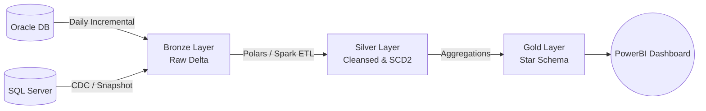
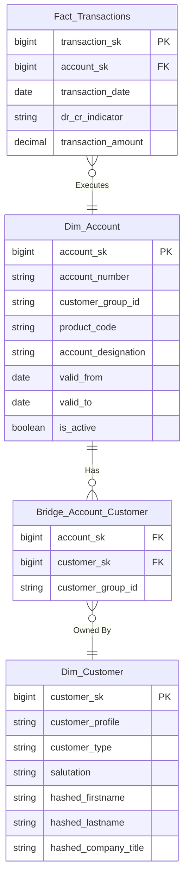

# APS Bank Senior Data Developer Technical Assessment - Matthew Camilleri Mifsud

## 1. Requirements Gathering

**1. Any clarifying questions you would ask stakeholders (business and technical).:**

*   *Frequency:* What's the expected frequency of this data? For example: daily, hourly, or real-time. Does this apply for both transaction and customer data? Current assumption is both need to have the same frequency,if transaction data is in real-time while customer is daily, there will be transactions from unidentified customers. If this requires to be in real-time, the 'TRANSACITON_DATE' field should be specified including the date and time, ie. DD/MM/YYYY HH:MM:SS:mss
*   *Currency:* No mention of currency is included in any dataset, what is the currency used in this data and is it aligned with the one to be outputted into? 
*   *Transaction Revision:* How would an incorrect transaction be corrected? Straight modification of transaction amount to the same incorrect transaction ID, or is it proceeded with other transaction that balance to the sought after amount?
*   *Financial Control:* What controls should the transactions satisfy? Limitations per account/group; limit in number of transactions per day; If so, should we include  __control fields__ to identify which are satisfactory to regulations and not? For exmaple, indicator field (Yes/No) and reason (in case of anomaly) 
*   *1EUR Transactions:* There are 104 transactions from 302 which amount is just 1 EUR. Are these as made for account verifiaction purposes?
*   *Definition of Terms:* By 'profile' do we mean a client/customer who have transacted to/from this bank? What is the term 'product code' refering to?

**2. Your assumptions for any unanswered questions:**

*   the term profile refers to a client. Henceforth, an identifiable profile is mentioned as an indentifiable customer/client.
*   All datasets are snapshots at end of day.
*   No agrgegation is made based on account number, every transaction occured at each day is identified with a unique ID.

**Short description of banking nuances considered:**

*   *CIF Defitinion* : Client Identification File - used to identify each client, to link multiple account per client.
*   **Immutability:** Financial transactions are immutable. Modifications are typically compensating entries.
*   **PII Masking:** Names and titles are encrypted/hashed, this personal identifiable data is witheld for compliance.

## 2. Ingestion, Transformation, and Storage 

**Target Architecture:**

1.  **Bronze (Raw):** Ingest raw data from Oracle (via daily incrementals on `transaction_date`) and SQL Server (CDC using Debezium or daily full snapshots). Data is stored in Data Lake (S3/ADLS) as Delta/Iceberg tables.
2.  **Silver (Cleaned & Conformed):** Data types are standardized (e.g., DD/MM/YYYY strings converted to datetime types). Nulls are handled /flagged.
3.  **Gold (Dimensional Data Mart):** Datasets oriented for business end-users' use-case. A Star schema plays the central skeleton for a clear structured understanding of the busineess and its' data, for inference and analytics.

**Key Methodologies:**

*   **New vs. Changed Data:** 
    *   *Transactions:* Data is only appended/added, not modified or deleted. Filtered by transaction date against a new field _data-entry_ date.
    *   *Accounts/Customers:* Can be aggregated by account/customer number, for each has it's features/attributes ordered by the datetime of data-entry in descending order (latest). 
*   **Late-Arriving Transactions:** By adding a field with the datetime of data entry, differentiating from transaction instance and data entry instance, one can distinguish between backdated and not for the transaction time needs to be equal or greater/after the data-entry date. For the raw data is naturally sorted by data-entry datetime, since the entry is appended only, such reports like transaction hsitory needs to be sorted by the transaction date, while account details reports need to be sorted by data-entry date since the latest features entered need to be presented as the current feautre. 
*   **History Keeping:** 
    *   *Transactions:* All data is kept and sorted by data-entry date, and uniquely identified by a data-entry surragate key  (example _dentry-id_) accompanied by the datetime of the instance.
    *   *Accounts/Customers:* All account specification change activity is kept and the latest value is selected as the current accepted feature.
*   **Idempotency:** By agrgegating/merging the raw data by the data-entry & transaction date and transaction id and keeping only the latest instance, in case of a double entry of data batch,  the information is not duplicated or the account change/transaction amount is multiplied. For instance, if we join the Transaction table directly to a Customer table by account-number to gather all transactions occured in a selected time itnerval, a 100EUR transaction to a joint account (owned by 2 people) will show up in two rows. Sum aggregating that up unknowingly, it will falsely look like 200EUR.

## 3. Data Modelling
**1. Data Warehouse**

A star schema is employed here for demonstration of how this datawarehouse would look like. 

#### 1. Fact_Transactions

*   **Primary Key:** `Transaction_KEY` (Surrogate Key)
*   **Natural Key:** `Transaction_Number` (From Source)
*   **Grain:** One row per individual transaction event.
*   **Relationships:** Connects to `Dim_Account` via `Account_KEY` (Foreign Key).
*   **History Strategy:** Append-only (financial facts are immutable).

| Transaction_KEY | Account_KEY | Transaction_Number | Transaction_Date | Debit_Credit | Amount | data_entry_datetime | data_entry_id |
| :--- | :--- | :--- | :--- | :--- | :--- | :--- | :--- |
| **500001** | **1001** | 205906841 | 2026-12-30 | C | 1.00 | 2024-01-01 02:00:00 | ETL-RUN-901 |
| **500002** | **1002** | 205576482 | 2026-12-28 | D | 93120.93 | 2024-01-01 02:00:00 | ETL-RUN-901 |
| **500003** | **1003** | 205288197 | 2026-12-23 | D | 15000.00 | 2026-12-24 02:00:00 | ETL-RUN-895 |

#### 2. Dim_Account

*   **Primary Key:** `Account_KEY` (Surrogate Key)
*   **Natural Key:** `Account_Number` (From Source)
*   **Grain:** One row per account *version*.
*   **Relationships:** Provides context for `Fact_Transactions` (1:N) and links to `Bridge_Account_Customer` (N:N - customer with multiple accounts & joint accounts).
*   **History Strategy:** Slowly Changing Dimension (SCD) Type 2. We track changes over time using `Valid_From`, `Valid_To`, and `Is_Active`.

| Account_KEY | Account_Number | Product_Code | Valid_From | Valid_To | Is_Active | data_entry_datetime | data_entry_id |
| :--- | :--- | :--- | :--- | :--- | :--- | :--- | :--- |
| **1001** | 9F5994A296CFD... | 100 | 2026-01-01 | 9999-12-31 | True | 2026-01-02 02:00:00 | ETL-RUN-105 |
| **1003** | F63AF4A875D76... | 425 | 2025-06-15 | 2026-11-01 | False | 2025-06-16 02:00:00 | ETL-RUN-055 |
| **1004** | F63AF4A875D76... | 450 *(Changed)* | 2026-11-02 | 9999-12-31 | True | 2026-11-03 02:00:00 | ETL-RUN-810 |

#### 3. Dim_Customer

*   **Primary Key:** `Customer_KEY` (Surrogate Key)
*   **Natural Key:** `Customer_Profile_ID` (From Source)
*   **Grain:** One row per customer profile *version*.
*   **Relationships:** Filtered by `Bridge_Account_Customer` (1:N).
*   **History Strategy:** SCD Type 2. If a customer's type or details change, the old record is closed, and a new row is created.

| Customer_KEY | Customer_Profile_ID | Customer_Type | First_Name (Hashed) | Valid_From | Valid_To | Is_Active | data_entry_datetime | data_entry_id |
| :--- | :--- | :--- | :--- | :--- | :--- | :--- | :--- | :--- |
| **2001** | 6239 | Physical | 0x9269... | 2020-01-01 | 9999-12-31 | True | 2020-01-02 02:00:00 | ETL-RUN-002 |
| **2002** | 10450 | Physical | 0xAD4E... | 2021-03-15 | 9999-12-31 | True | 2021-03-16 02:00:00 | ETL-RUN-034 |
| **2003** | 10586 | Corporate | NULL | 2019-08-22 | 9999-12-31 | True | 2019-08-23 02:00:00 | ETL-RUN-001 |

#### 4. Bridge_Account_Customer

*   **Primary Key:** Compound Key (`Account_KEY` + `Customer_KEY`)
*   **Grain:** One row per specific Account-to-Customer relationship mapping.
*   **Relationships:** Bridges the Many-to-Many relationship between `Dim_Account` and `Dim_Customer` without duplicating financial facts.
*   **History Strategy:** Overwrite (SCD Type 1) or recreated on load to map current active relationships, as point-in-time querying is handled via the dimension dates.

| Account_KEY (FK) | Customer_KEY (FK) | Customer_Group_ID | data_entry_datetime | data_entry_id |
| :--- | :--- | :--- | :--- | :--- |
| **1001** | **2003** | 356277 | 2024-01-01 02:05:00 | ETL-RUN-901 |
| **1002** | **2001** | 420160 | 2024-01-01 02:05:00 | ETL-RUN-901 |
| **1004** | **2002** | 414861 | 2024-01-01 02:05:00 | ETL-RUN-901 |
| **1004** | **2001** | 414861 *(Customer w/ Multiple Accounts)* | 2024-01-01 02:05:00 | ETL-RUN-901 |
| **1005** | **2006** | 435458 | 2024-02-01 03:05:00 | ETL-RUN-901 |
| **1005** | **2007** | 765296 *(Account w/ Multiple Clients)* | 2024-02-01 03:05:00 | ETL-RUN-901 |


**2. Transaction Data Mart**

*   **Schema Choice:** A fact table related to multiple dimension tables -  **Star Schema**
    *   *Pros:* It is the industry standard for the analytical space. It clearly maps the application/business and also enabling fast and efficient aggregations (sums, averages) whilst preventing data duplication.
    *   *Alternative considered:* Merging everything into a single table. *Cons:* This would create massive duplication of customer/account data for every single row, making it very hard to manage when customer details change, to interpret data and more difficult to track customer behaviour for example. 
*   **Fact Table (`Fact_Transactions`):** Contains ID, KEY, amounts, dates, and other indicator ffields, ie. Credit/Debit. 
*   **Dimension Tables:** `Dim_Account` and `Dim_Customer` (including a `customer_type` column to filter by Physical or Corporate).

**3.  Customer Type and Profile Group Complexity**
In the sample data profile number *1001865* may be a joint account to customers *367901* and *407622*, while the same customer *367901* is linked to 10 different profile numbers which may be that a customer has more than one account. Additionally, given the data samples provided, coutning the number of different profiles per customer equates to the number of different accounts per customer, which hints that the term 'profile' here is acitng as a key with the customer-account number keys. Hence, defining clearly per profile number : the customer number, account number and, customer type. 

## 4. Data Quality and Controls
| Check | Rule Definition | Layer | Action on Failure |
| :--- | :--- | :--- | :--- |
| **Validity** | Each fields satisfies its respective dtype, ie. transaction_number set to integer so must contain only number, fields with amounts should only contain float values, etc.  | Bronze → Silver | Segregate the row into a seperate dataset called 'Rejects' |
| **Completeness** | `transaction_amount` is not NULL and > 0 | Bronze → Silver | Move row to 'Rejects'|
| **Validity** | `debit_credit` IN ('C', 'D') | Bronze → Silver | Move row to 'Rejects' |
| **Integrity** | `transaction_account_number` exists in `Accounts` | Silver → Gold | Allow row, link to `Unknown` surrogate key in `Dim_Account`, raise Warning alert |
| **Integrity** | `product_code` follows standard taxonomy | Silver | Log warning, proceed with 'Unknown' |

## 5. Transactions Dashboard Design
**Tooling:** PowerBI or Tableau.
*   **Header / Filters:** 
    *   Date Range Slicer (Start Date / End Date).
    *   Customer Type Slicer (Physical / Corporate).
*   **KPI Scorecard (Top):**
    *   Total Transaction Value (Selected Period).
    *   Average Value of Monthly Transactions.
    *   Average Number of Monthly Transactions.
*   **Charts (Middle):**
    *   *Bar Chart:* Value of Monthly Transactions by Month (Split by C/D).
    *   *Line Chart:* Number of Monthly Transactions by Month (Trend).
*   **Tables (Bottom):**
    *   *Top 3 Customers by Transaction Value* (Using the Bridge table to map Accounts to Customers).

---

## `ERD_and_DataFlow.md`

**Data Flow Architecture**



**Logical Data Model (Data Mart ERD)**


*Design Choice / Trade-offs:* As one account (mapped to `customer_group_id`) can belong to multiple profiles (joint accounts), directly linking `Fact_Transactions` to `Dim_Customer` causes a Many-to-Many Cartesian explosion, miscalculating sums. The **Bridge Table** resolves this. Pros: Mathematically accurate aggregates, accurately reflects joint accounts. Cons: Requires an extra `JOIN` impacting query performance on massive datasets.

---

## `ETL_Pipeline.py`
This Python script uses **Polars** to fulfill the request for data manipulation, proving the ETL logic and dynamically answering the three BI questions.

```python
import polars as pl

def execute_pipeline():
    print("--- 1. Ingestion (Bronze) ---")
    # In a real environment, these are read from S3/ADLS Delta Tables
    df_txns = pl.read_csv("Oracle_Transactions.csv", separator=";")
    df_accs = pl.read_csv("Oracle_Accounts.csv", separator=";", infer_schema_length=10000)
    df_prof = pl.read_csv("Oracle_Profile_Groups.csv", separator=";", infer_schema_length=10000)
    
    df_cust = pl.read_csv("SQLServer_BANKING_CUSTOMERS.csv", separator=";")
    df_phys = pl.read_csv("SQLServer_PHYSICAL_CUSTOMERS.csv", separator=";")
    df_corp = pl.read_csv("SQLServer_CORPORATE_CUSTOMERS.csv", separator=";")

    print("--- 2. Transformation (Silver) ---")
    # Standardize Dates and numeric formats
    df_txns = df_txns.with_columns(
        pl.col("TRANSACTION_DATE").str.strptime(pl.Date, "%d/%m/%Y"),
        pl.col("TRANSACTION_AMOUNT").cast(pl.Float64)
    )

    # Resolve Customer Types
    df_cust_enriched = df_cust.join(df_phys, on="CUSTOMER_PK", how="left").join(
        df_corp, on="CUSTOMER_PK", how="left"
    ).with_columns(
        pl.when(pl.col("COMPANY_TITLE").is_not_null())
        .then(pl.lit("CORPORATE"))
        .otherwise(pl.lit("PHYSICAL"))
        .alias("CUSTOMER_TYPE")
    )

    print("--- 3. Modeling (Gold - Data Mart) ---")
    # In a real DW, we generate Surrogate Keys. Using natural keys for this exercise.
    fact_transactions = df_txns
    dim_account = df_accs
    dim_customer = df_cust_enriched

    # Create Bridge Table to handle Many-to-Many Account/Customer Relationship
    # Account -> Customer Group -> Profiles
    bridge_account_customer = dim_account.select(["ACCOUNT_NUMBER", "CUSTOMER_GROUP_ID"]).join(
        df_prof, on="CUSTOMER_GROUP_ID", how="inner"
    ).select([
        pl.col("ACCOUNT_NUMBER"),
        pl.col("PROFILE_NUMBER").alias("CUSTOMER_PROFILE")
    ])

    print("--- 4. Business Intelligence Queries (Polars Execution) ---")

    # Q1: Monthly Account Balances
    # Assume 0 start on 01/01/2026.
    # Group by Account and Month
    q1_monthly_net = fact_transactions.with_columns(
        pl.col("TRANSACTION_DATE").dt.truncate("1mo").alias("MONTH"),
        pl.when(pl.col("DEBIT_CREDIT") == "C")
        .then(pl.col("TRANSACTION_AMOUNT"))
        .otherwise(-pl.col("TRANSACTION_AMOUNT"))
        .alias("NET_AMOUNT")
    ).group_by(["TRANSACTION_ACCOUNT_NUMBER", "MONTH"]).agg(
        pl.sum("NET_AMOUNT").alias("MONTHLY_NET")
    ).sort(["TRANSACTION_ACCOUNT_NUMBER", "MONTH"])

    # Calculate Cumulative Sum using Window functions
    q1_balances = q1_monthly_net.with_columns(
        pl.col("MONTHLY_NET").cum_sum().over("TRANSACTION_ACCOUNT_NUMBER").alias("RUNNING_BALANCE")
    )
    print("\nQ1: Sample Monthly Account Balances:")
    print(q1_balances.head(5))

    # Q2: Customer Transactions for Date Range
    target_profile = 29235  # Sample Profile
    start_date, end_date = pl.date(2026, 1, 1), pl.date(2026, 12, 31)
    
    # Traverse Fact -> Bridge -> Customer
    q2_cust_txns = fact_transactions.join(
        bridge_account_customer, left_on="TRANSACTION_ACCOUNT_NUMBER", right_on="ACCOUNT_NUMBER", how="inner"
    ).filter(
        (pl.col("CUSTOMER_PROFILE") == target_profile) &
        (pl.col("TRANSACTION_DATE") >= start_date) &
        (pl.col("TRANSACTION_DATE") <= end_date)
    )
    print(f"\nQ2: Transactions for Profile {target_profile} in 2026: {q2_cust_txns.height} found.")

    # Q3: Month with Highest Deposits Total
    q3_top_month = fact_transactions.filter(
        pl.col("DEBIT_CREDIT") == "C"
    ).with_columns(
        pl.col("TRANSACTION_DATE").dt.truncate("1mo").alias("MONTH")
    ).group_by("MONTH").agg(
        pl.sum("TRANSACTION_AMOUNT").alias("TOTAL_DEPOSITS")
    ).sort("TOTAL_DEPOSITS", descending=True).head(1)
    
    print("\nQ3: Month with Highest Deposits Total:")
    print(q3_top_month)

if __name__ == "__main__":
    execute_pipeline()
```

---

## SQL Folder

### `01_monthly_balances.sql`
*Note: To ensure accounts with 0 transactions in a given month show their carried-over balance, a Calendar generation approach is typically required in SQL. Standard ANSI SQL is used.*
```sql
WITH recursive_months AS (
    -- Assuming PostgreSQL / Snowflake dialect for date series
    SELECT CAST('2026-01-01' AS DATE) AS report_month
    UNION ALL
    SELECT report_month + INTERVAL '1 month'
    FROM recursive_months
    WHERE report_month < CURRENT_DATE
),
accounts_and_months AS (
    -- Create a row for every account for every month
    SELECT a.account_number, rm.report_month
    FROM Dim_Account a
    CROSS JOIN recursive_months rm
),
monthly_nets AS (
    -- Calculate net transaction amount per account per month
    SELECT 
        transaction_account_number AS account_number,
        DATE_TRUNC('month', transaction_date) AS report_month,
        SUM(CASE WHEN debit_credit = 'C' THEN transaction_amount ELSE -transaction_amount END) AS net_amount
    FROM Fact_Transactions
    GROUP BY 1, 2
)
-- Join the generated calendar with nets and compute running total
SELECT 
    am.account_number,
    am.report_month,
    COALESCE(mn.net_amount, 0) AS monthly_net_change,
    SUM(COALESCE(mn.net_amount, 0)) OVER (
        PARTITION BY am.account_number 
        ORDER BY am.report_month 
        ROWS BETWEEN UNBOUNDED PRECEDING AND CURRENT ROW
    ) AS running_balance
FROM accounts_and_months am
LEFT JOIN monthly_nets mn 
    ON am.account_number = mn.account_number 
    AND am.report_month = mn.report_month
WHERE am.report_month BETWEEN @StartDate AND @EndDate
ORDER BY am.account_number, am.report_month;
```

### `02_customer_transactions.sql`
```sql
SELECT 
    t.transaction_number,
    t.transaction_date,
    t.debit_credit,
    t.transaction_amount,
    a.account_number,
    c.customer_profile,
    c.customer_type
FROM Fact_Transactions t
-- Bridge handles the M:N relationship
JOIN Bridge_Account_Customer b 
    ON t.account_sk = b.account_sk
JOIN Dim_Account a 
    ON t.account_sk = a.account_sk
JOIN Dim_Customer c 
    ON b.customer_sk = c.customer_sk
WHERE c.customer_profile = @CustomerProfileId
  AND t.transaction_date BETWEEN @StartDate AND @EndDate
ORDER BY t.transaction_date DESC;
```

### `03_top_deposit_month.sql`
```sql
SELECT 
    DATE_TRUNC('month', transaction_date) AS deposit_month,
    SUM(transaction_amount) AS total_deposits
FROM Fact_Transactions
WHERE debit_credit = 'C' 
  AND transaction_date >= '2026-01-01'
GROUP BY DATE_TRUNC('month', transaction_date)
ORDER BY total_deposits DESC
LIMIT 1;
```